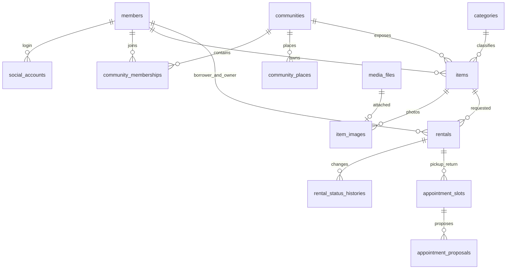
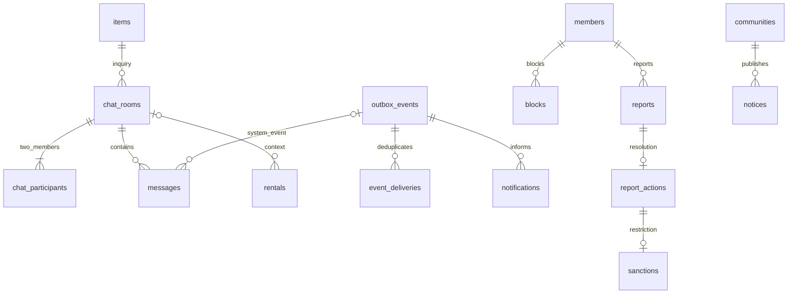

# 도메인 및 DB 설계

> 버전 : v0.1.0\
> 수정일 : 2026.09.29

## 1. 공통 규칙

| 항목 | 규칙 |
| --- | --- |
| DB·문자셋 | MySQL 8.4 InnoDB · utf8mb4 |
| PK/FK | 양수 signed BIGINT. API에서는 십진 문자열로 전달 |
| id | AUTO_INCREMENT |
| created_at / updated_at | NOT NULL DATETIME(6), 애플리케이션이 UTC로 채움. DB 연결 time_zone도 UTC 고정 |
| DATE | Asia/Seoul의 달력 날짜 |
| DATETIME(6) | UTC instant. API는 RFC 3339 Z 형식 |
| NULL 표기 | N은 NOT NULL, Y는 NULL 허용. NULL 컬럼은 API 응답에서 필드 생략. 빈 문자열은 NULL 대용 금지 |
| ENUM | VARCHAR + 애플리케이션 enum 및 CHECK로 구현하는 제안. DBML 노트의 CHECK·범위·최대 행 수는 실제 DDL 작성 시 별도 구현 |
| FK 삭제/수정 | RESTRICT. 거래·메시지·제재·신고 이력은 연쇄 삭제 금지. blocks만 해제 시 관계 행 삭제 가능 |
| UNIQUE·인덱스 | DBML에 명시. FK 대상 존재 검사와 도메인 일치 검사(같은 동네/같은 방)는 서로 다른 검사 |
| 사용자 위치 | 어떤 테이블에도 보존하지 않음. communities·community_places의 좌표는 공개 장소 기준 정보 |
| 토큰·키 비교 | token/state/storage key/UUID는 대소문자·바이트 비교 기준을 정함. 한국어 제목 정렬과 다른 collation이 필요하면 컬럼 수준에서 지정 |

## 2. 도메인 관계

## 3. 테이블 목록

| 테이블 | 담당 | 단계 | 목적 |
| --- | --- | --- | --- |
| [members](#members--회원-식별과-계정-상태--p0) | A 이지은 | P0 | 회원 식별과 계정 상태 |
| [social_accounts](#social_accounts--소셜-제공자와-내부-회원-연결--p0) | A 이지은 | P0 | 소셜 제공자와 내부 회원 연결 |
| [auth_sessions](#auth_sessions--쿠키-세션-저장소--p0) | A 이지은 | P0 | 쿠키 세션 저장소 |
| [oauth_login_attempts](#oauth_login_attempts--oauth-state와-브라우저-세션-결합--p0) | A 이지은 | P0 | OAuth state와 브라우저 세션 결합 |
| [communities](#communities--생활권-커뮤니티-기준-정보--p0) | E 노현섭 | P0 | 생활권 커뮤니티 기준 정보 |
| [community_memberships](#community_memberships--회원별-소속인증-결과--p0) | E 노현섭 | P0 | 회원별 소속·인증 결과 |
| [community_places](#community_places--물건과-약속이-공유하는-공용-장소--p0) | E 노현섭 | P0 | 물건과 약속이 공유하는 공용 장소 |
| [categories](#categories--단일-카테고리-목록--p0) | B 주정현 | P0 | 등록·검색·운영 통계의 단일 카테고리 목록 |
| [media_files](#media_files--영속-볼륨-이미지-메타데이터--p0) | B 주정현 | P0 | 영속 볼륨 이미지 메타데이터 |
| [items](#items--대여-물건과-등록-가능-기간--p0) | B 주정현 | P0 | 대여 물건과 등록 가능 기간 |
| [item_images](#item_images--물건-사진과-표시-순서--p0) | B 주정현 | P0 | 물건 사진과 표시 순서 |
| [rentals](#rentals--대여-요청과-거래-원장--p0) | C 박소빈 | P0 | 대여 요청과 거래 원장 |
| [rental_status_histories](#rental_status_histories--상태-전이-감사-이력--p0) | C 박소빈 | P0 | 상태 전이 감사 이력 |
| [appointment_slots](#appointment_slots--전달반납-약속별-동시성-제어-기준--p1) | C 박소빈 | P1 | 전달/반납 약속별 동시성 제어 기준 |
| [appointment_proposals](#appointment_proposals--약속-변경-제안-이력--p1) | C 박소빈 | P1 | 약속 변경 제안 이력 |
| [chat_rooms](#chat_rooms--물건별-두-회원의-대화방--p1) | D 박선우 | P1 | 물건별 두 회원의 대화방 |
| [chat_participants](#chat_participants--채팅-읽음-위치--p1) | D 박선우 | P1 | 채팅 읽음 위치 |
| [messages](#messages--텍스트와-거래-시스템-메시지--p1) | D 박선우 | P1 | 텍스트와 거래 시스템 메시지 |
| [outbox_events](#outbox_events--커밋된-도메인-사건--p0-사건-생산은-공통) | 공통 생산 / D 전달 | P0 | 커밋된 도메인 사건 |
| [event_deliveries](#event_deliveries--소비자별-사건-중복-방지--p0) | D 박선우 | P0 | 소비자별 사건 중복 방지 |
| [notifications](#notifications--회원별-앱-내-알림--p0) | D 박선우 | P0 | 회원별 앱 내 알림 |
| [blocks](#blocks--방향성-차단-관계--p1) | E 노현섭 | P1 | 방향성 차단 관계 |
| [reports](#reports--신고-접수와-처리-상태--p1) | E 노현섭 | P1 | 신고 접수와 처리 상태 |
| [report_actions](#report_actions--관리자-신고-처리-이력--p1) | E 노현섭 | P1 | 관리자 신고 처리 이력 |
| [sanctions](#sanctions--회원-이용-제한과-해제-이력--p1-e-결정--a-적용) | E 결정 / A 적용 | P1 | 회원 이용 제한과 해제 이력 |
| [notices](#notices--커뮤니티-공지--p2) | E 노현섭 | P2 | 커뮤니티 공지 |
| [idempotency_records](#idempotency_records--post-명령의-안전한-재전송--p0-공통--a-기반) | 공통 / A 기반 | P0 | POST 명령의 안전한 재전송 |

## 4. 테이블 상세

### 4.1 회원·인증 (A 이지은)

#### members — 회원 식별과 계정 상태 · P0

| 컬럼 | 타입 | NULL | 규칙·의미 | 참조 |
| --- | --- | --- | --- | --- |
| id | bigint | N | PK · AUTO_INCREMENT | — |
| display_name | varchar(30) | N | 2~30자 표시 이름 | — |
| role | varchar(10) | N | USER / ADMIN. 기본 USER | — |
| status | varchar(20) | N | ACTIVE / WITHDRAWN. 일시·영구 제한은 sanctions에서 판정 | — |
| active_community_id | bigint | Y | 선택된 커뮤니티. 유효 소속과의 일치는 서비스 검사 | communities.id |
| withdrawn_at | datetime(6) | Y | 탈퇴 정책 확정 후 사용 | — |
| version | bigint | N | 낙관적 잠금. 기본 0 | — |
| created_at | datetime(6) | N | UTC 생성 시각 | — |
| updated_at | datetime(6) | N | UTC 최종 수정 시각 | — |

인덱스: PK 외 별도 제안 없음.

- 표시 이름은 중복 허용. 이메일·전화번호·집 주소 수집은 기본 범위 밖.
- 소셜 계정 매핑만으로 재로그인하며 이름으로 계정을 합치지 않는다.

#### social_accounts — 소셜 제공자와 내부 회원 연결 · P0

| 컬럼 | 타입 | NULL | 규칙·의미 | 참조 |
| --- | --- | --- | --- | --- |
| id | bigint | N | PK · AUTO_INCREMENT | — |
| member_id | bigint | N | 회원 | members.id |
| provider | varchar(20) | N | KAKAO. NAVER는 후순위 | — |
| provider_subject | varchar(100) | N | 제공자의 불변 식별자. 대소문자 구분 비교 | — |
| created_at | datetime(6) | N | UTC 생성 시각 | — |
| updated_at | datetime(6) | N | UTC 최종 수정 시각 | — |

인덱스: UNIQUE (provider, provider_subject) · INDEX (member_id)

- 제공자 액세스 토큰은 로그인 처리 중에만 사용하고 저장하지 않는다.

#### auth_sessions — 쿠키 세션 저장소 · P0

| 컬럼 | 타입 | NULL | 규칙·의미 | 참조 |
| --- | --- | --- | --- | --- |
| id | bigint | N | PK · AUTO_INCREMENT | — |
| member_id | bigint | Y | 로그인 전 CSRF/OAuth 세션은 NULL | members.id |
| token_hash | char(64) | N | 256비트 이상 무작위 쿠키 값의 SHA-256. 쿠키 원문 저장 금지 | — |
| csrf_token | varchar(64) | N | 세션에 결합한 무작위 CSRF 토큰 | — |
| last_seen_at | datetime(6) | N | 유휴 만료 판정 시각 | — |
| expires_at | datetime(6) | N | 유휴 만료. 갱신해도 절대 만료 초과 금지 | — |
| absolute_expires_at | datetime(6) | N | 로그인 시각 + 24시간 제안 | — |
| revoked_at | datetime(6) | Y | 로그아웃/회전 폐기 시각 | — |
| created_at | datetime(6) | N | UTC 생성 시각 | — |
| updated_at | datetime(6) | N | UTC 최종 수정 시각 | — |

인덱스: UNIQUE (token_hash) · INDEX (member_id, revoked_at) · INDEX (expires_at)

- Spring Session JDBC를 채택하면 이 논리 저장소를 프레임워크 표준 테이블로 대체한다. 중복 운영하지 않는다.

#### oauth_login_attempts — OAuth state와 브라우저 세션 결합 · P0

| 컬럼 | 타입 | NULL | 규칙·의미 | 참조 |
| --- | --- | --- | --- | --- |
| id | bigint | N | PK · AUTO_INCREMENT | — |
| session_id | bigint | N | 로그인 전 세션 | auth_sessions.id |
| state_hash | char(64) | N | 무작위 state 해시 | — |
| provider | varchar(20) | N | KAKAO | — |
| expires_at | datetime(6) | N | 발급 후 10분 제안 | — |
| consumed_at | datetime(6) | Y | 콜백에서 원자적으로 한 번 소비 | — |
| created_at | datetime(6) | N | UTC 생성 시각 | — |
| updated_at | datetime(6) | N | UTC 최종 수정 시각 | — |

인덱스: UNIQUE (state_hash) · INDEX (expires_at)

- callback은 state와 세션 쿠키를 함께 확인한다. return URL은 서버 고정 허용 경로만 사용한다.

### 4.2 커뮤니티 (E 노현섭)

#### communities — 생활권 커뮤니티 기준 정보 · P0

| 컬럼 | 타입 | NULL | 규칙·의미 | 참조 |
| --- | --- | --- | --- | --- |
| id | bigint | N | PK · AUTO_INCREMENT | — |
| name | varchar(100) | N | 동네/단지 이름 | — |
| display_address | varchar(255) | N | 공개 커뮤니티 주소. 개인 집 주소 아님 | — |
| center_latitude | decimal(10,7) | N | -90~90 | — |
| center_longitude | decimal(10,7) | N | -180~180 | — |
| verification_radius_m | int | N | 양수 인증 반경 | — |
| status | varchar(10) | N | ACTIVE / INACTIVE | — |
| created_at | datetime(6) | N | UTC 생성 시각 | — |
| updated_at | datetime(6) | N | UTC 최종 수정 시각 | — |

인덱스: INDEX (status, name, id)

- 운영 seed로 등록한다. 커뮤니티 생성·경계 편집 관리자 UI는 범위 밖.

#### community_memberships — 회원별 소속·인증 결과 · P0

| 컬럼 | 타입 | NULL | 규칙·의미 | 참조 |
| --- | --- | --- | --- | --- |
| id | bigint | N | PK · AUTO_INCREMENT | — |
| member_id | bigint | N | 회원 | members.id |
| community_id | bigint | N | 커뮤니티 | communities.id |
| status | varchar(10) | N | ACTIVE / LEFT | — |
| verified_at | datetime(6) | N | 마지막 성공 인증 시각 | — |
| verification_expires_at | datetime(6) | N | verified_at + 30일 제안 | — |
| left_at | datetime(6) | Y | 이전 소속에서 이탈한 시각 | — |
| created_at | datetime(6) | N | UTC 생성 시각 | — |
| updated_at | datetime(6) | N | UTC 최종 수정 시각 | — |

인덱스: UNIQUE (member_id, community_id) · INDEX (community_id, status, verification_expires_at)

- 활성 소속은 회원당 하나. members 잠금 아래 검사한다.
- 개인 위치·정확도·이동 기록은 저장하지 않는다. 인증 재시도는 같은 행을 갱신한다.

#### community_places — 물건과 약속이 공유하는 공용 장소 · P0

| 컬럼 | 타입 | NULL | 규칙·의미 | 참조 |
| --- | --- | --- | --- | --- |
| id | bigint | N | PK · AUTO_INCREMENT | — |
| community_id | bigint | N | 커뮤니티 | communities.id |
| name | varchar(100) | N | 공용 장소 이름 | — |
| latitude | decimal(10,7) | N | 공개 장소 좌표 | — |
| longitude | decimal(10,7) | N | 공개 장소 좌표 | — |
| guide | varchar(300) | Y | 만남 안내 | — |
| active | boolean | N | 기본 true | — |
| created_at | datetime(6) | N | UTC 생성 시각 | — |
| updated_at | datetime(6) | N | UTC 최종 수정 시각 | — |

인덱스: INDEX (community_id, active, id)

- 물건/약속의 community_id와 일치하는지 서비스 검사. 사용된 장소는 물리 삭제하지 않는다.

### 4.3 물건 (B 주정현)

#### categories — 단일 카테고리 목록 · P0

| 컬럼 | 타입 | NULL | 규칙·의미 | 참조 |
| --- | --- | --- | --- | --- |
| id | bigint | N | PK · AUTO_INCREMENT | — |
| code | varchar(20) | N | TOOL/CAMP/TRAVEL/BABY/MUSIC/SPORT/KITCHEN/CLEAN/LIFE/OTHER | — |
| name | varchar(30) | N | 사용자 표시명 | — |
| sort_order | int | N | 표시 순서 | — |
| active | boolean | N | 기본 true | — |
| created_at | datetime(6) | N | UTC 생성 시각 | — |
| updated_at | datetime(6) | N | UTC 최종 수정 시각 | — |

인덱스: UNIQUE (code)

- 등록·검색·운영 통계가 이 공통 목록 하나를 쓴다.

#### media_files — 영속 볼륨 이미지 메타데이터 · P0

| 컬럼 | 타입 | NULL | 규칙·의미 | 참조 |
| --- | --- | --- | --- | --- |
| id | bigint | N | PK · AUTO_INCREMENT | — |
| uploader_id | bigint | N | 업로더 | members.id |
| storage_key | varchar(255) | N | 서버 생성 상대 키. API에 노출 금지 | — |
| mime_type | varchar(30) | N | image/jpeg, image/png, image/webp | — |
| byte_size | bigint | N | 1~10485760 | — |
| width | int | N | 디코딩한 양수 너비 | — |
| height | int | N | 디코딩한 양수 높이 | — |
| status | varchar(10) | N | TEMP / ATTACHED / DELETED | — |
| expires_at | datetime(6) | N | 미연결 TEMP 업로드의 24시간 만료 | — |
| deleted_at | datetime(6) | Y | 정리 시각 | — |
| created_at | datetime(6) | N | UTC 생성 시각 | — |
| updated_at | datetime(6) | N | UTC 최종 수정 시각 | — |

인덱스: UNIQUE (storage_key) · INDEX (status, expires_at) · INDEX (uploader_id, id)

- 파일 실제 내용 검사·메타데이터 제거·재인코딩. 경로 조작 금지. 원자적 rename 후 메타데이터 기록, 실패 고아 파일은 정리한다.

#### items — 대여 물건과 등록 가능 기간 · P0

| 컬럼 | 타입 | NULL | 규칙·의미 | 참조 |
| --- | --- | --- | --- | --- |
| id | bigint | N | PK · AUTO_INCREMENT | — |
| owner_id | bigint | N | 소유자. 생성 후 변경 금지 | members.id |
| community_id | bigint | N | 등록 당시 커뮤니티. 변경 금지 | communities.id |
| category_id | bigint | N | 분류 | categories.id |
| place_id | bigint | N | 기본 거래 장소 | community_places.id |
| title | varchar(100) | N | 1~100자 | — |
| description | varchar(3000) | Y | 구성품·주의사항 | — |
| available_start_date | date | N | KST 대여 가능 시작 | — |
| available_end_date | date | N | KST 대여 가능 끝 | — |
| visibility | varchar(10) | N | PUBLIC / HIDDEN / DELETED | — |
| deleted_at | datetime(6) | Y | 논리 삭제 시각 | — |
| version | bigint | N | 기본 0 | — |
| created_at | datetime(6) | N | UTC 생성 시각 | — |
| updated_at | datetime(6) | N | UTC 최종 수정 시각 | — |

인덱스: INDEX (community_id, visibility, created_at, id) · INDEX (community_id, visibility, category_id, created_at, id) · INDEX (owner_id, visibility, id)

- CHECK available_start_date <= available_end_date. owner/community 불변.
- 제목 부분 문자열 검색은 초기 LIKE로 측정한다. 일반 B-tree가 임의 부분 검색을 해결한다고 가정하지 않는다.
- 같은 물건의 예약과 기간 수정은 이 행의 잠금을 공유한다.

#### item_images — 물건 사진과 표시 순서 · P0

| 컬럼 | 타입 | NULL | 규칙·의미 | 참조 |
| --- | --- | --- | --- | --- |
| id | bigint | N | PK · AUTO_INCREMENT | — |
| item_id | bigint | N | 물건 | items.id |
| media_file_id | bigint | N | 업로드 파일 | media_files.id |
| sort_order | int | N | 0~4. 0이 대표 사진 | — |
| created_at | datetime(6) | N | UTC 생성 시각 | — |
| updated_at | datetime(6) | N | UTC 최종 수정 시각 | — |

인덱스: UNIQUE (item_id, sort_order) · UNIQUE (media_file_id)

- 1~5장 수량·업로더 소유권은 item 잠금 아래 검사한다.
- 진행 거래가 있는 물건은 사진 제거를 거부해 기존 거래의 자료를 보존한다.

### 4.4 대여·약속 (C 박소빈)

#### rentals — 대여 요청과 거래 원장 · P0

| 컬럼 | 타입 | NULL | 규칙·의미 | 참조 |
| --- | --- | --- | --- | --- |
| id | bigint | N | PK · AUTO_INCREMENT | — |
| item_id | bigint | N | 물건 | items.id |
| owner_id | bigint | N | 생성 당시 물건 소유자 | members.id |
| borrower_id | bigint | N | 요청자 | members.id |
| community_id | bigint | N | 생성 당시 소속 | communities.id |
| chat_room_id | bigint | Y | P1 방 개설 시 연결. 한 방에 여러 거래 | chat_rooms.id |
| start_date | date | N | KST 시작일 | — |
| end_date | date | N | KST 반납일. 양끝 포함 | — |
| status | varchar(15) | N | REQUESTED / APPROVED / REJECTED / CANCELED / ACTIVE / RETURNED / EXPIRED | — |
| request_expires_at | datetime(6) | N | 시작일 다음 날 KST 00:00의 UTC 값 | — |
| due_at | datetime(6) | N | 반납일 다음 날 KST 00:00의 UTC 값 | — |
| item_title_snapshot | varchar(100) | N | 거래 생성 당시 제목 | — |
| place_name_snapshot | varchar(100) | N | 기본 장소 표시 스냅샷 | — |
| place_id | bigint | N | 기본 공용 장소 | community_places.id |
| reason | varchar(500) | Y | 최종 거절/취소 사유 | — |
| approved_at | datetime(6) | Y | 승인 시각 | — |
| handed_over_at | datetime(6) | Y | 전달 확인 시각 | — |
| returned_at | datetime(6) | Y | 반납 확인 서버 시각 | — |
| return_promise_at | datetime(6) | Y | 반납 시점 확정 RETURN 약속 시각 스냅샷 | — |
| return_promise_kept | boolean | Y | 약속 없음 NULL. 확인 시각 <= 약속 시각 | — |
| version | bigint | N | 기본 0 | — |
| created_at | datetime(6) | N | UTC 생성 시각 | — |
| updated_at | datetime(6) | N | UTC 최종 수정 시각 | — |

인덱스: INDEX (item_id, status, start_date, end_date) · INDEX (borrower_id, status, created_at, id) · INDEX (owner_id, status, created_at, id) · INDEX (status, request_expires_at) · INDEX (chat_room_id, id)

- CHECK start_date <= end_date, owner_id <> borrower_id. item의 owner/community와 일치하는지는 서비스 검사.
- 기간 중복은 트랜잭션으로 검사한다. RETURNED도 종료일까지 점유를 유지한다.
- 승인 시 다른 REQUESTED를 자동 거절하지 않는다.

#### rental_status_histories — 상태 전이 감사 이력 · P0

| 컬럼 | 타입 | NULL | 규칙·의미 | 참조 |
| --- | --- | --- | --- | --- |
| id | bigint | N | PK · AUTO_INCREMENT | — |
| rental_id | bigint | N | 대여 | rentals.id |
| actor_id | bigint | Y | 시스템 만료는 NULL | members.id |
| from_status | varchar(15) | Y | 생성은 NULL | — |
| to_status | varchar(15) | N | 변경 후 상태 | — |
| reason | varchar(500) | Y | 거절/취소 사유 | — |
| rental_version | bigint | N | 변경 후 version | — |
| created_at | datetime(6) | N | UTC 생성 시각 | — |
| updated_at | datetime(6) | N | UTC 최종 수정 시각 | — |

인덱스: UNIQUE (rental_id, rental_version)

- 추가 전용. 거래·outbox와 같은 트랜잭션.

#### appointment_slots — 전달/반납 약속별 동시성 제어 기준 · P1

| 컬럼 | 타입 | NULL | 규칙·의미 | 참조 |
| --- | --- | --- | --- | --- |
| id | bigint | N | PK · AUTO_INCREMENT | — |
| rental_id | bigint | N | 거래 | rentals.id |
| kind | varchar(10) | N | PICKUP / RETURN | — |
| confirmed_proposal_id | bigint | Y | 현재 확정 제안 | appointment_proposals.id |
| version | bigint | N | 제안·수락·철회 시 증가 | — |
| created_at | datetime(6) | N | UTC 생성 시각 | — |
| updated_at | datetime(6) | N | UTC 최종 수정 시각 | — |

인덱스: UNIQUE (rental_id, kind)

- confirmed_proposal_id는 동일 slot의 CONFIRMED 제안이어야 한다. FK 순환은 NULL 슬롯 생성 → 제안 → 참조 갱신 순서로 해결한다.

#### appointment_proposals — 약속 변경 제안 이력 · P1

| 컬럼 | 타입 | NULL | 규칙·의미 | 참조 |
| --- | --- | --- | --- | --- |
| id | bigint | N | PK · AUTO_INCREMENT | — |
| slot_id | bigint | N | 전달 또는 반납 슬롯 | appointment_slots.id |
| proposer_id | bigint | N | 제안자 | members.id |
| place_id | bigint | N | 공용 장소 | community_places.id |
| scheduled_at | datetime(6) | N | KST 약정 날짜의 선택 시각을 UTC 저장 | — |
| place_name_snapshot | varchar(100) | N | 제안 당시 장소명 | — |
| status | varchar(15) | N | PROPOSED / CONFIRMED / SUPERSEDED / WITHDRAWN | — |
| accepted_by | bigint | Y | 수락자. 제안자와 달라야 함 | members.id |
| accepted_at | datetime(6) | Y | 수락 시각 | — |
| created_at | datetime(6) | N | UTC 생성 시각 | — |
| updated_at | datetime(6) | N | UTC 최종 수정 시각 | — |

인덱스: INDEX (slot_id, status, id)

- slot당 최대 PROPOSED 1개·CONFIRMED 1개. 슬롯 잠금 안에서 보장한다.
- 변경 제안 중에도 기존 CONFIRMED를 유지하고, 새 제안 수락 시 교체한다.

### 4.5 채팅 (D 박선우)

#### chat_rooms — 물건별 두 회원의 대화방 · P1

| 컬럼 | 타입 | NULL | 규칙·의미 | 참조 |
| --- | --- | --- | --- | --- |
| id | bigint | N | PK · AUTO_INCREMENT | — |
| item_id | bigint | N | 물건 | items.id |
| owner_id | bigint | N | 물건 소유자 | members.id |
| requester_id | bigint | N | 문의자 | members.id |
| next_sequence | bigint | N | 기본 1. 메시지마다 방 잠금 아래 할당 | — |
| last_message_at | datetime(6) | Y | 목록 정렬용 서버 시각 | — |
| created_at | datetime(6) | N | UTC 생성 시각 | — |
| updated_at | datetime(6) | N | UTC 최종 수정 시각 | — |

인덱스: UNIQUE (item_id, requester_id) · INDEX (owner_id, last_message_at, id) · INDEX (requester_id, last_message_at, id)

- CHECK owner_id <> requester_id. room의 owner는 item owner와 일치. 두 참여자는 생성 후 불변.

#### chat_participants — 채팅 읽음 위치 · P1

| 컬럼 | 타입 | NULL | 규칙·의미 | 참조 |
| --- | --- | --- | --- | --- |
| id | bigint | N | PK · AUTO_INCREMENT | — |
| room_id | bigint | N | 방 | chat_rooms.id |
| member_id | bigint | N | 참여자 | members.id |
| last_read_sequence | bigint | N | 기본 0. 해당 방 안에서 단조 증가 | — |
| created_at | datetime(6) | N | UTC 생성 시각 | — |
| updated_at | datetime(6) | N | UTC 최종 수정 시각 | — |

인덱스: UNIQUE (room_id, member_id) · INDEX (member_id, room_id)

- 방 생성 트랜잭션에서 소유자·문의자 정확히 두 행을 생성한다.

#### messages — 텍스트와 거래 시스템 메시지 · P1

| 컬럼 | 타입 | NULL | 규칙·의미 | 참조 |
| --- | --- | --- | --- | --- |
| id | bigint | N | PK · AUTO_INCREMENT | — |
| room_id | bigint | N | 방 | chat_rooms.id |
| sequence | bigint | N | 방 안의 순서. 1 이상 | — |
| sender_id | bigint | Y | SYSTEM은 NULL | members.id |
| type | varchar(10) | N | TEXT / SYSTEM | — |
| body | varchar(2000) | Y | TEXT는 1~2000자 | — |
| rental_id | bigint | Y | 연결 거래. 차단 중 기존 거래 메시지는 필수 | rentals.id |
| appointment_proposal_id | bigint | Y | 약속 사건 연결 | appointment_proposals.id |
| event_id | bigint | Y | 시스템 메시지의 원본 사건 | outbox_events.id |
| client_message_id | char(36) | Y | TEXT 클라이언트 UUID | — |
| system_payload | json | Y | SYSTEM 사건 종류·변경 version·발생 시각 | — |
| created_at | datetime(6) | N | UTC 생성 시각 | — |
| updated_at | datetime(6) | N | UTC 최종 수정 시각 | — |

인덱스: UNIQUE (room_id, sequence) · UNIQUE (room_id, sender_id, client_message_id) · UNIQUE (room_id, event_id)

- client UUID 재전송 시 내용 해시가 같으면 기존 메시지 반환, 다르면 409.
- sequence 배정과 insert를 같은 방 잠금 트랜잭션으로 처리한다.

### 4.6 사건·알림 (D 박선우)

#### outbox_events — 커밋된 도메인 사건 · P0 (사건 생산은 공통)

| 컬럼 | 타입 | NULL | 규칙·의미 | 참조 |
| --- | --- | --- | --- | --- |
| id | bigint | N | PK · AUTO_INCREMENT | — |
| event_key | varchar(150) | N | 예: rental:501:version:2:approved | — |
| event_type | varchar(50) | N | RENTAL_* / APPOINTMENT_* / REPORT_RESOLVED | — |
| aggregate_type | varchar(20) | N | RENTAL / APPOINTMENT_SLOT / REPORT | — |
| aggregate_id | bigint | N | aggregate_type에 따른 논리 참조. 다형 FK 없음 | — |
| aggregate_version | bigint | N | 사건 생성 시 version | — |
| payload | json | N | 수신 회원 ID·대상 ID·버전·최소 표시 정보 | — |
| status | varchar(15) | N | PENDING / PROCESSING / DONE / FAILED | — |
| attempts | int | N | 기본 0 | — |
| available_at | datetime(6) | N | 다음 시도 | — |
| lease_until | datetime(6) | Y | 작업자 장애 시 재획득 | — |
| processed_at | datetime(6) | Y | 소비 완료 | — |
| created_at | datetime(6) | N | UTC 생성 시각 | — |
| updated_at | datetime(6) | N | UTC 최종 수정 시각 | — |

인덱스: UNIQUE (event_key) · INDEX (status, available_at, id)

- 민감한 인증 비밀값·개인 좌표는 payload에 넣지 않는다. lease 만료 시 재시도한다.

#### event_deliveries — 소비자별 사건 중복 방지 · P0

| 컬럼 | 타입 | NULL | 규칙·의미 | 참조 |
| --- | --- | --- | --- | --- |
| id | bigint | N | PK · AUTO_INCREMENT | — |
| event_id | bigint | N | 사건 | outbox_events.id |
| consumer_key | varchar(100) | N | notification:{memberId} 또는 room:{roomId} | — |
| delivered_at | datetime(6) | N | 결과 저장과 같은 트랜잭션의 성공 기록 | — |
| created_at | datetime(6) | N | UTC 생성 시각 | — |
| updated_at | datetime(6) | N | UTC 최종 수정 시각 | — |

인덱스: UNIQUE (event_id, consumer_key)

- 알림/시스템 메시지 생성과 성공 기록의 원자성을 보장한다.

#### notifications — 회원별 앱 내 알림 · P0

| 컬럼 | 타입 | NULL | 규칙·의미 | 참조 |
| --- | --- | --- | --- | --- |
| id | bigint | N | PK · AUTO_INCREMENT | — |
| recipient_id | bigint | N | 수신 회원 | members.id |
| event_id | bigint | N | 사건 | outbox_events.id |
| type | varchar(50) | N | 사건 유형 | — |
| title | varchar(200) | N | 당시 표시 문구 | — |
| target_type | varchar(20) | N | RENTAL / REPORT / MEMBER_SELF | — |
| target_id | bigint | N | target_type 기준 논리 참조 | — |
| read_at | datetime(6) | Y | 미열람 NULL | — |
| created_at | datetime(6) | N | UTC 생성 시각 | — |
| updated_at | datetime(6) | N | UTC 최종 수정 시각 | — |

인덱스: UNIQUE (event_id, recipient_id) · INDEX (recipient_id, read_at, id) · INDEX (recipient_id, id)

- 알림 이동 시 서버 권한을 재검사한다. 모두 읽음 기준 ID 이후의 신규 알림은 미열람을 유지한다.
- 신고자는 REPORT, 제재 대상은 MEMBER_SELF(자기 회원 ID)로 이동한다. 신고자 정보는 제재 대상에게 노출하지 않는다.

### 4.7 안전·운영 (E 노현섭)

#### blocks — 방향성 차단 관계 · P1

| 컬럼 | 타입 | NULL | 규칙·의미 | 참조 |
| --- | --- | --- | --- | --- |
| id | bigint | N | PK · AUTO_INCREMENT | — |
| blocker_id | bigint | N | 차단 실행자 | members.id |
| blocked_id | bigint | N | 차단 대상 | members.id |
| created_at | datetime(6) | N | UTC 생성 시각 | — |
| updated_at | datetime(6) | N | UTC 최종 수정 시각 | — |

인덱스: UNIQUE (blocker_id, blocked_id) · INDEX (blocked_id, blocker_id)

- CHECK blocker_id <> blocked_id. 관계 판정은 양방향 OR. 해제 시 해당 방향 행만 삭제한다.

#### reports — 신고 접수와 처리 상태 · P1

| 컬럼 | 타입 | NULL | 규칙·의미 | 참조 |
| --- | --- | --- | --- | --- |
| id | bigint | N | PK · AUTO_INCREMENT | — |
| reporter_id | bigint | N | 신고자 | members.id |
| target_type | varchar(10) | N | MEMBER / ITEM / MESSAGE | — |
| target_member_id | bigint | N | 서버 계산 처리 대상 | members.id |
| target_item_id | bigint | Y | ITEM만 사용 | items.id |
| target_message_id | bigint | Y | MESSAGE만 사용 | messages.id |
| community_id | bigint | N | 신고 맥락의 커뮤니티 | communities.id |
| reason_code | varchar(30) | N | MONEY_REQUEST / ITEM_MISMATCH / NO_SHOW / ABUSE / FRAUD / OTHER | — |
| detail | varchar(1000) | Y | OTHER일 때 필수 | — |
| status | varchar(10) | N | PENDING / RESOLVED | — |
| version | bigint | N | 기본 0 | — |
| target_snapshot | json | N | 접수 시 대상 제목/메시지 등 최소 증거 스냅샷. 관리자만 공개 | — |
| created_at | datetime(6) | N | UTC 생성 시각 | — |
| updated_at | datetime(6) | N | UTC 최종 수정 시각 | — |

인덱스: INDEX (reporter_id, created_at, id) · INDEX (community_id, status, created_at, id)

- MEMBER면 item/message NULL, ITEM이면 item만, MESSAGE면 message만. 자기 자신 신고 불가.
- 접근 가능한 대상만 신고할 수 있다. 같은 미처리 대상·사유의 중복 신고는 reporter 잠금 안에서 거부한다.

#### report_actions — 관리자 신고 처리 이력 · P1

| 컬럼 | 타입 | NULL | 규칙·의미 | 참조 |
| --- | --- | --- | --- | --- |
| id | bigint | N | PK · AUTO_INCREMENT | — |
| report_id | bigint | N | 신고 | reports.id |
| admin_id | bigint | N | ADMIN 역할 실행자 | members.id |
| action | varchar(20) | N | WARN / SUSPEND_7D / SUSPEND_30D / BAN / DISMISS | — |
| public_reason | varchar(500) | N | 대상·신고자에 표시할 사유 | — |
| internal_note | varchar(2000) | Y | 관리자만 조회 | — |
| created_at | datetime(6) | N | UTC 생성 시각 | — |
| updated_at | datetime(6) | N | UTC 최종 수정 시각 | — |

인덱스: UNIQUE (report_id)

- 한 신고는 한 번 처리한다. report 상태/version·제재·outbox와 같은 트랜잭션.

#### sanctions — 회원 이용 제한과 해제 이력 · P1 (E 결정 / A 적용)

| 컬럼 | 타입 | NULL | 규칙·의미 | 참조 |
| --- | --- | --- | --- | --- |
| id | bigint | N | PK · AUTO_INCREMENT | — |
| member_id | bigint | N | 제재 대상 | members.id |
| report_action_id | bigint | N | 처리 근거 | report_actions.id |
| kind | varchar(10) | N | SUSPEND / BAN | — |
| starts_at | datetime(6) | N | 처리 시각 | — |
| ends_at | datetime(6) | Y | BAN은 NULL | — |
| revoked_at | datetime(6) | Y | 해제 시각 | — |
| revoked_by | bigint | Y | 해제 관리자 | members.id |
| revoke_reason | varchar(500) | Y | 해제 사유 | — |
| created_at | datetime(6) | N | UTC 생성 시각 | — |
| updated_at | datetime(6) | N | UTC 최종 수정 시각 | — |

인덱스: UNIQUE (report_action_id) · INDEX (member_id, revoked_at, ends_at)

- 유효 = revoked_at NULL AND starts_at <= now AND (ends_at NULL OR now < ends_at). 겹치는 제재는 하나라도 유효하면 제한한다.

#### notices — 커뮤니티 공지 · P2

| 컬럼 | 타입 | NULL | 규칙·의미 | 참조 |
| --- | --- | --- | --- | --- |
| id | bigint | N | PK · AUTO_INCREMENT | — |
| community_id | bigint | N | 대상 커뮤니티 | communities.id |
| author_id | bigint | N | 관리자 | members.id |
| title | varchar(150) | N | 1~150자 | — |
| body | text | N | 1~10000자 일반 텍스트 | — |
| pinned | boolean | N | 기본 false | — |
| deleted_at | datetime(6) | Y | 논리 삭제 | — |
| version | bigint | N | 기본 0 | — |
| created_at | datetime(6) | N | UTC 생성 시각 | — |
| updated_at | datetime(6) | N | UTC 최종 수정 시각 | — |

인덱스: INDEX (community_id, deleted_at, pinned, created_at, id)

### 4.8 공통

#### idempotency_records — POST 명령의 안전한 재전송 · P0 (공통 / A 기반)

| 컬럼 | 타입 | NULL | 규칙·의미 | 참조 |
| --- | --- | --- | --- | --- |
| id | bigint | N | PK · AUTO_INCREMENT | — |
| member_id | bigint | N | 실행자 | members.id |
| operation_key | varchar(150) | N | HTTP method + 정규화된 실제 path | — |
| request_key | char(36) | N | Idempotency-Key UUID | — |
| request_hash | char(64) | N | 검증된 canonical 요청의 SHA-256 | — |
| http_status | int | N | 완료한 성공 응답 코드 | — |
| response_body | json | N | 성공 응답 스냅샷. 세션 비밀값/좌표 제외 | — |
| expires_at | datetime(6) | N | 생성 후 24시간 제안 | — |
| created_at | datetime(6) | N | UTC 생성 시각 | — |
| updated_at | datetime(6) | N | UTC 최종 수정 시각 | — |

인덱스: UNIQUE (member_id, operation_key, request_key) · INDEX (expires_at)

- 회원 행 잠금 후 조회하고, 부수효과와 결과 기록을 하나의 트랜잭션에서 커밋한다. 중간 IN_PROGRESS 행은 외부에 노출하지 않는다.
- 멱등 재응답도 인증·리소스 조회 권한을 재검사한다. 명령 상태/version 검사는 최초 실행에만 적용한다.
- multipart 이미지는 재인코딩 전 입력 바이트 해시를 포함한다. 24시간 이후 재요청은 신규 처리될 수 있으므로 거래 자체의 중복 제약도 필요하다.

## 5. 마이그레이션과 구현 순서

1. communities·members를 먼저 생성하되 members.active_community_id 순환 관계가 생기지 않도록 참조 순서를 조정한다. 나머지 부모 테이블부터 생성한다.
2. appointment_slots.confirmed_proposal_id는 nullable로 만들고 appointment_proposals 생성 후 ALTER TABLE로 FK를 추가한다.
3. rentals.chat_room_id, messages.event_id 등의 FK는 모든 대상 테이블 생성 이후 일괄 추가할 수 있다.
4. 카테고리 10개, 시연용 동네·공용 장소를 seed한다. 관리자 역할 부여는 운영 초기화 절차로 제한한다.
5. P1 투입 시 기존 APPROVED/ACTIVE/RETURNED 대여의 PICKUP·RETURN 슬롯을 backfill한다. 약속 없는 과거 거래는 신뢰 준수 분모에 포함되지 않는다.
6. API version은 각 엔티티의 version 필드로 맞추고, 동일 요청 재전송은 idempotency_records로 처리한다.

## 6. DB 제약만으로 해결되지 않는 조건

| 조건 | 검사·잠금 기준 |
| --- | --- |
| 같은 날짜 중복 승인 | items 잠금 + 최신 rentals 범위 검사 |
| 한 회원 활성 동네 하나 | members 잠금 + memberships 갱신 |
| 사진 1~5장 | items 잠금 + item_images 수/순서·업로더 검사 |
| 물건·장소·대여의 동네 일치 | 부모 조회 후 서비스 검사 |
| 한 슬롯의 현재/대기 제안 최대 하나 | rental → slot 잠금 + pointer/status 갱신 |
| 채팅 참여자 2명과 거래 맥락 | room 생성 트랜잭션 + 요청별 참여자 검사 |
| report 대상 유형과 FK 조합 | CHECK 및 대상 접근 검사 |
| 제재와 거래 정리 예외 | sanctions 조회 + action별 권한 정책 |
| 상태 변경 후 알림 누락/중복 | outbox 원자 저장 + 소비 결과·event_deliveries 원자 저장 |

인덱스는 시작 후보이며 효과를 보장하는 결론이 아니다. \
회원 1천 명·물건 1천 개·대여 요청 2만 건의 고정 seed로 실행 계획·잠금 대기·응답 시간을 측정한다.
